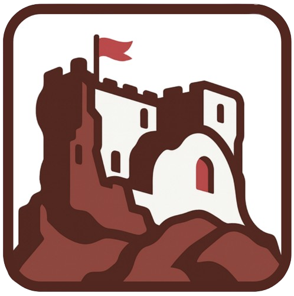

<p align="center">
  
</p>

<h1 align="center">La historia de Cea</h1>

<p align="center"><em>Cejam civitatem mirificam</em> — «Cea, ciudad maravillosa» (Crónica Albeldense, s. IX)</p>

<p align="center">
  🌍 <strong><a href="https://historiacea.github.io">historiacea.github.io</a></strong>
</p>

---

**Mil años de historia de un pueblo de León, contados para que no se pierdan.**

Este proyecto recoge la memoria de **Cea** (León, Tierra de Campos): desde los castros vacceos hasta el éxodo rural, pasando por la reina Urraca, los condes y monasterios, la Nodicia de Kesos, el puente de piedra y su **castillo del siglo XV con planta en esvástica, único en España**.

Es un proyecto **sin ánimo de lucro**, hecho por amor al pueblo y a su historia. No hay publicidad, no se vende nada, no se pide dinero. Solo memoria.

## 📖 Qué encontrarás

- **[La Historia](https://historiacea.github.io/docs/historia/intro)** — 41 capítulos en 8 partes, de la prehistoria al siglo XXI.
- **[El Castillo](https://historiacea.github.io/docs/castillo)** — su historia, planos planta a planta en 3D, modelo fotogramétrico, vídeos y 58 fotos.
- **[La Cronología](https://historiacea.github.io/cronologia)** — todos los hitos en una línea temporal interactiva.
- **[Recuerdos del pueblo](https://historiacea.github.io/recuerdos)** — el álbum colectivo de fotos antiguas.

## 🤝 Cómo colaborar

**Este proyecto lo construimos entre todos.** No hace falta saber de informática ni de historia: basta con tener algo que contar. Nos puedes ayudar con:

- 📷 **Fotos antiguas** del pueblo, sus gentes, sus fiestas, el castillo, el puente… Por borrosa o pequeña que parezca, **es un tesoro**. Hazle una foto con el móvil y mándala.
- 📜 **Documentos**: escrituras, recortes de prensa, programas de fiestas, cartas, papeles del cajón.
- 🗣️ **Recuerdos y testimonios**: cómo era la escuela, la matanza, las eras, los bares, los apodos, los dichos.
- ✏️ **Correcciones**: si encuentras un error, un nombre mal puesto o una fecha equivocada, dínoslo.
- 📣 **Difusión**: comparte la web con la familia y con quienes se fueron del pueblo. Cada visita mantiene viva la memoria.

**👉 Escríbenos a [historiadecealeon@gmail.com](mailto:historiadecealeon@gmail.com?subject=Colaboración%20Historia%20de%20Cea)**

Si nos envías una foto, cuéntanos lo que sepas de ella (año aproximado, lugar, quiénes salen) y si quieres aparecer **acreditado con tu nombre**.

## 🚨 El castillo necesita ayuda

El castillo de Cea está en la **[Lista Roja del Patrimonio de Hispania Nostra](https://listarojapatrimonio.org/ficha/castillo-de-cea/)** desde 2008, en **ruina progresiva**. En 2015 parte del lienzo se desplomó sobre el río. Conocerlo, visitarlo y difundir su situación es el primer paso para salvarlo.

## ⚖️ Sobre las imágenes

Las fotografías de las galerías proceden de **aportaciones vecinales y fuentes públicas**, reunidas sin ánimo de lucro con fines de preservación. Si una imagen es tuya y quieres que se **acredite o se retire, escríbenos y lo haremos de inmediato**. Más detalles en el [aviso legal](https://historiacea.github.io/docs/aviso-legal).

## 🙏 Agradecimientos

A la **página de Facebook por la defensa del Castillo de Cea**, a **Hispania Nostra**, a los medios leoneses que cubren el estado del monumento, a los autores de los modelos 3D y vídeos, y sobre todo a los **vecinos y descendientes de Cea** que comparten sus recuerdos.

---

<details>
<summary>🛠️ Para desarrolladores</summary>

Sitio estático construido con [Docusaurus](https://docusaurus.io/) (React + TypeScript + MDX).

```bash
npm ci          # instalar dependencias
npm start       # desarrollo en http://localhost:3000
npm run build   # build de producción
```

El deploy a GitHub Pages es **automático** al hacer push a `main` (GitHub Actions).

Cosas útiles:
- El **email de contacto** se cambia en una sola constante: `CONTACT_EMAIL` en `docusaurus.config.ts`.
- Las **galerías** cargan las fotos automáticamente de `static/img/castillo/galeria/` y `static/img/recuerdos/` — para añadir fotos basta copiarlas ahí.
- Las **fichas de las fotos** (autor, año, fuente) se editan en `src/data/fichasFotos.ts`.
- La **cronología** se edita en `src/data/cronologia.ts`.

</details>
